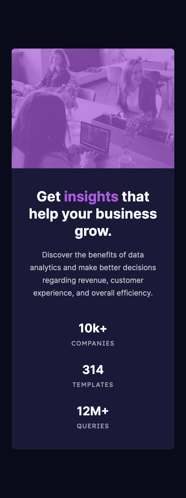

# Frontend Mentor - Stats preview card component solution

This is a solution to the [Stats preview card component challenge on Frontend Mentor](https://www.frontendmentor.io/challenges/stats-preview-card-component-8JqbgoU62). Frontend Mentor challenges help you improve your coding skills by building realistic projects.

## Table of contents

- [Overview](#overview)
  - [The challenge](#the-challenge)
  - [Screenshot](#screenshot)
  - [Links](#links)
- [My process](#my-process)
  - [Built with](#built-with)
  - [What I learned](#what-i-learned)
  - [Continued development](#continued-development)
- [Author](#author)

## Overview

Building a responsive stats preview component with flexbox.

### The challenge

Users should be able to:

- View the optimal layout depending on their device's screen size

### Screenshot

### Links

- Solution URL: [solution URL](https://github.com/A-C-Sai/stats-preview-card-component)
- Live Site URL: [live site URL](https://a-c-sai.github.io/stats-preview-card-component/)

## My process

### Built with

- Semantic HTML5 markup
- CSS custom properties
- Flexbox
- Mobile-first workflow

### What I learned

- Used the <picture> tag for the first time

### Continued development

- I found it hard to size the card and the component, felt like I used properties susch as max/min-width and somehow made it workout without fully understanding.
- need to improve my media querires.
- Need to learn how to analyze a layout and translate it into html better.

## Author

- Frontend Mentor - [@A-C-Sai](https://www.frontendmentor.io/profile/yourusername)
